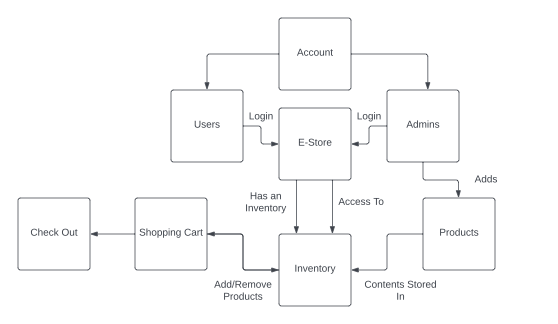

# PROJECT Design Documentation

> _The following template provides the headings for your Design
> Documentation.  As you edit each section make sure you remove these
> commentary 'blockquotes'; the lines that start with a > character
> and appear in the generated PDF in italics._

## Team Information
* Team name: Team 2
* Team members
  * Emily
  * Lucy
  * Grahith
  * Shreyes

## Executive Summary

We are building an ecommerce store to sell plants. We are using REST APIs to create the basic configuration of a website and using Angular to create the user interface. This e-store will allow users to login with a unique username and password, allow customers to hold onto items in their shopping cart, and allow admins to make any changes neccessary to the inventory and individual products.

### Purpose

Our project is called The Garden. We provide a user friendly webpage to allow customers to purchase potted plants.

### Glossary and Acronyms

| Term | Definition |
|------|------------|
| SPA | Single Page Application |
| HTML | HyperText Markup Language |
| MVVM | Model–View–ViewModel architecture pattern |
| CSS | Cascading Style Sheets |
| JSON | JavaScript Object Notation |
| REST | Representational State Transfer |
| API | Application Programming Interface |
| CRUD | Create, Read, Update, Delete |
| HTTP | Hypertext Transfer Protocol |
| URL | Uniform Resource Locator |
| JaCoCo | Java Code Coverage Library |

## Requirements

This section describes the features of the application.

> _In this section you do not need to be exhaustive and list every
> story.  Focus on top-level features from the Vision document and
> maybe Epics and critical Stories._

### Definition of MVP
A website configured as an e-store to allow interactions between sellers and buyers. Customers must be able to buy plants that they would like to purchase and the admins sell their goods.

### MVP Features
 * As a customer, I want to be able to view Plants on the website in order to buy the product.
 * As a customer, I want to be able to edit my shopping cart in order to purchase Plants.
 * As a customer, I want to be able to search for Plants in order to quickly find the ones I'm looking for.
 * As a customer, I want to be able to log into the website in order to save my products.

 * As an admin I want to be able to edit the inventory to see how I see fit in order to sell my Plants.
 * As an admin I want to be able to view the e-store in order to interact with it.

### Roadmap of Enhancements
Product, Inventory, User, Customer, Shopping Cart, Website, Search Bar

## Application Domain

This section describes the application domain.

The admin is the overseer of the store, manipulating the inventory to how they see fit, adding or deleting products.

Customers view the inventory, select Plants based on their preferences, and add them to their shopping cart.

Once added to the shopping cart, customers are able to checkout, essentially purchasing the product and removing it from the inventory in the process.

## Architecture and Design

This section describes the application architecture.

### Summary

The following Tiers/Layers model shows a high-level view of the webapp's architecture.

The e-store web application, is built using the Model–View–ViewModel (MVVM) architecture pattern. 

The Model stores the application data objects including any functionality to provide persistance. 

The View is the client-side SPA built with Angular utilizing HTML, CSS and TypeScript. The ViewModel provides RESTful APIs to the client (View) as well as any logic required to manipulate the data objects from the Model.

Both the ViewModel and Model are built using Java and Spring Framework. Details of the components within these tiers are supplied below.

### Overview of User Interface

This section describes the web interface flow; this is how the user views and interacts
with the e-store application.

The user begins at the home page with only the option to log in to ensure a user account is being cached. After this, if the username is the admin username, the user, who is an owner, will be able to see the inventory as well as add and delete items. Once an item is clicked, the owner will be able to edit the price, stock, and name of the product. If the user logs in as a customer, the interface is different, they can see the inventory without some of the rights that the admin has. They are able to click on a product in order to view the product's details as well as add it to their cart. The customer can click on the Shopping Cart link to be routed to their current shopping cart. From there they can remove any items they wish.

### View Tier

 The View Tier is the client-side SPA built with Angular utilizing HTML, CSS and TypeScript. The View Tier is responsible for displaying the user interface to the user. The View Tier is also responsible for sending HTTP requests to the ViewModel Tier to retrieve data from the Model Tier. The View Tier is also responsible for sending HTTP requests to the ViewModel Tier to update data in the Model Tier.

### ViewModel Tier

The ViewModel tier is responsible for providing the RESTful APIs to the client (View) as well as any logic required to manipulate the data objects from the Model.

The ViewModel tier is built using Java and Spring Framework. The following components are used to implement the tier:

* Spring Boot
* Spring Data JPA

### Model Tier

The Model tier is responsible for storing the application data objects and providing persistance. The Model tier is built using Java and Spring Framework. The Model tier is comprised of the following components:

* **Entity Classes** - These are the data objects that are stored in the database.  They are annotated with JPA annotations to provide persistance.  The following are the Entity classes:

  * **Product** - This class represents a product that is sold by the e-store.  It has the following attributes:
    * id - The unique identifier for the product
    * name - The name of the product
    * price - The price of the product
    * Quantity - The number of items in stock

  * **User** - This class represents a user of the e-store.  It has the following attributes:
    * id - The unique identifier for the user
    * username - The username of the user
    * password - The password of the user
    * Cart[] - The shopping cart of the user (an array of products)

* **Repositories** - These are the interfaces that are used to access the data objects.  They are annotated with JPA annotations to provide persistance.  The following are the Repository interfaces:

  * **ProductRepository** - This interface provides CRUD operations for the Product data object.
  * **UserRepository** - This interface provides CRUD operations for the User data object.

* **Services** - These are the classes that provide the business logic for the application.  The following are the Service classes:

  * **ProductService** - This class provides the business logic for the Product data object.
  * **UserService** - This class provides the business logic for the User data object.

* **Controllers** - These are the classes that provide the RESTful APIs for the application.  The following are the Controller classes:
  
    * **PlantController** - This class provides the RESTful APIs for the Plant data object.
    * **UserController** - This class provides the RESTful APIs for the User data object.

* **Application** - This is the main class that starts the Spring Boot application.

### Static Code Analysis/Design Improvements
> _Discuss design improvements that you would make if the project were
> to continue. These improvement should be based on your direct
> analysis of where there are problems in the code base which could be
> addressed with design changes, and describe those suggested design
> improvements._

> _With the results from the Static Code Analysis exercise, 
> discuss the resulting issues/metrics measurements along with your analysis
> and recommendations for further improvements. Where relevant, include 
> screenshots from the tool and/or corresponding source code that was flagged._

## Testing
> _This section will provide information about the testing performed
> and the results of the testing._

### Acceptance Testing

* Buyers being able to successfully log into the website
* Buyers being able to add and delete Plants from their shopping cart
* Buyers being able to search for Plants in the store
* Buyers being able to add a review to a bean
* Admins being able to add, edit, and delete Plants from the store
* Persistence of buyer's shopping carts, and the website's inventory

### Unit Testing and Code Coverage
> _Discuss your unit testing strategy. Report on the code coverage
> achieved from unit testing of the code base. Discuss the team's
> coverage targets, why you selected those values, and how well your
> code coverage met your targets. If there are any anomalies, discuss
> those._

Our unit testing strategy is to make sure we cover as much code as we can.
We will make tests to verify both pass and fail for each function.
